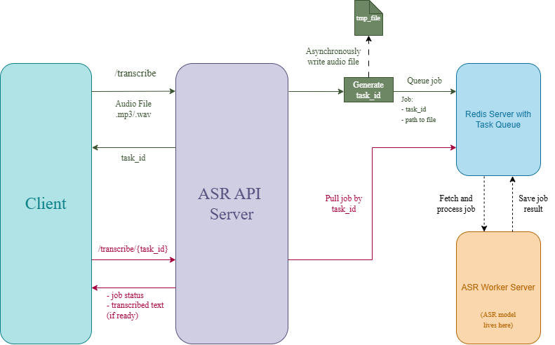

# Speech Processing API

An asynchronous speech-to-text service built with FastAPI, Faster-Whisper, and Redis Queue (RQ). Audio files are uploaded via a REST API, preprocessed, and transcribed in a separate worker process. Results are retrieved by polling.

---

## Architecture



The API and worker run as **separate processes**. The Whisper model is loaded only in the worker, keeping the API process lightweight.

### Preprocessing pipeline

Preprocessors are applied in this order before transcription:

1. **Loudness Normalizer** — LUFS, Peak, or RMS normalisation (configurable)
2. **Noise Reducer** — stationary or adaptive noise reduction via `noisereduce`

Either step can be disabled independently via environment variables.

---

## Requirements

- Docker and Docker Compose
- NVIDIA GPU + drivers (GPU build only)

---

## Running

**CPU build**
```bash
docker compose up --build
```

**GPU build**
```bash
docker compose -f docker-compose.yml -f docker-compose.gpu.yml up --build
```

The API will be available at `http://localhost:8000`.

---

## API

### `POST /api/v1/transcribe/`

Upload an audio file for transcription. Returns a `task_id` immediately.

**Accepted formats:** `.mp3`, `.wav`

```bash
curl -X POST http://localhost:8000/api/v1/transcribe/ \
  -F "file=@recording.wav"
```

**Response**
```json
{
  "task_id": "e3b0c442-98fc-4c14-9afb-ed8b1b3b0a1f"
}
```

---

### `GET /api/v1/transcribe/{task_id}`

Poll for the result of a transcription job.

```bash
curl http://localhost:8000/api/v1/transcribe/e3b0c442-98fc-4c14-9afb-ed8b1b3b0a1f
```

**Response — job in progress**
```json
{
  "status": "QUEUED",
  "result": null
}
```

**Response — job complete**
```json
{
  "status": "READY",
  "result": {
    "text": "Hello, this is a transcription.",
    "language": "en",
    "language_probability": 0.99
  }
}
```

**Task statuses**

| Status    | Meaning                                  |
|-----------|------------------------------------------|
| `QUEUED`  | Waiting in the queue                     |
| `STARTED` | Worker is actively processing            |
| `READY`   | Transcription complete, result available |
| `FAILED`  | Processing failed                        |

---

## Monitoring

The service includes built-in observability via **Prometheus**, **Grafana**, and **Loki**. Metrics are collected in the worker process and exposed on a dedicated HTTP endpoint. Logs from all containers are shipped to Loki via Promtail and are available alongside metrics in the same Grafana dashboard.

### Accessing dashboards

| Service    | URL                        | Credentials   |
|------------|----------------------------|---------------|
| Grafana    | http://localhost:3000      | admin / admin |
| Prometheus | http://localhost:9090      | —             |
| Loki       | http://localhost:3100      | —             |
| Metrics    | http://localhost:9091      | —             |

Grafana opens the ASR dashboard automatically on login. Prometheus targets status is available at `http://localhost:9090/targets` — the `asr-worker` target should show `UP`.

### Log collection

Logs are collected by **Promtail**, which tails Docker container output via the Docker socket. Each log line is tagged with two labels derived from Docker metadata:

- `service` — the Compose service name (`api`, `worker`, `redis`, …)
- `level` — the log severity extracted from loguru's JSON output (`INFO`, `WARNING`, `ERROR`, …); present only for API and worker containers

In production mode (`DEBUG=false`) loguru emits structured JSON, so `level` is always populated for application logs. Third-party containers (Redis, Prometheus) emit plain text — their logs are still collected but without the `level` label.

Logs are retained in Loki for **7 days**.

### Collected metrics

| Metric | Type | Description |
|--------|------|-------------|
| `asr_transcription_success_total` | Counter | Total successfully transcribed files |
| `asr_transcription_failure_total` | Counter | Total files that failed during transcription |
| `asr_real_time_factor` | Histogram | RTF: processing time / audio duration. Values below 1.0 indicate faster-than-real-time |
| `asr_audio_duration_minutes` | Histogram | Duration of processed audio files in minutes |
| `asr_language_detections_total` | Counter | Transcription count per detected language |
| `asr_worker_cpu_percent` | Gauge | Worker CPU utilisation, normalised to 0–100% |
| `asr_worker_memory_bytes` | Gauge | Worker RSS memory usage in bytes |
| `asr_worker_gpu_utilization_percent` | Gauge | GPU compute utilisation in percent (GPU build only) |
| `asr_worker_gpu_memory_used_bytes` | Gauge | GPU memory in use (GPU build only) |
| `asr_worker_gpu_memory_total_bytes` | Gauge | Total GPU memory available (GPU build only) |

### Dashboard panels

The Grafana dashboard is organised into five sections:

**Overview** — five stat panels showing total successes, total failures, success rate (last 10 min), average RTF, and throughput per minute.

**Performance** — RTF percentiles (P50/P90/P99) and audio duration percentiles over rolling windows.

**Language distribution** — bar chart of the top 10 detected languages by total transcription count.

**Worker system resources** — CPU utilisation, RSS memory, GPU compute utilisation, GPU memory usage, and a success/failure rate time series.

**Logs** — two log panels backed by Loki:
- *Application Logs* — all entries from the `api` and `worker` services, newest first. Supports full-text search and label filtering directly in the panel.
- *Errors & Warnings* — pre-filtered to `level=~"ERROR|WARNING"` across all services, for quick triage without scrolling through info-level noise.

---

## Configuration

All settings are read from environment variables (or a `.env` file). Defaults are production-ready for CPU inference.

### Model

| Variable                       | Default     | Description                                              |
|--------------------------------|-------------|----------------------------------------------------------|
| `MODEL_SIZE`                   | `small`     | Whisper model size: `tiny`, `base`, `small`, `medium`, `large-v2`, `large-v3` |
| `COMPUTE_DEVICE`               | `cpu`       | `cpu` or `cuda`                                          |
| `QUANTIZATION`                 | `int8`      | `int8`, `int8_float16`, `float16`, `float32`             |
| `VAD_ENABLED`                  | `true`      | Voice activity detection — skips silent segments         |
| `TARGET_SAMPLE_RATE`           | `16000`     | Audio sample rate in Hz (Whisper minimum)                |

### Loudness normalisation

| Variable                         | Default     | Description                                              |
|----------------------------------|-------------|----------------------------------------------------------|
| `LOUDNESS_NORMALIZATION_ENABLED` | `true`      | Enable/disable loudness normalisation                    |
| `LOUDNESS_METHOD`                | `lufs`      | `lufs`, `peak`, or `rms`                                 |
| `LOUDNESS_TARGET`                | `-23.0`     | Target loudness in LUFS (EBU R128 broadcast standard)    |

### Noise reduction

| Variable                       | Default     | Description                                              |
|--------------------------------|-------------|----------------------------------------------------------|
| `DENOISING_ENABLED`            | `true`      | Enable/disable noise reduction                           |
| `DENOISE_STATIONARY`           | `true`      | `true` for constant noise profile; `false` for adaptive  |
| `DENOISE_PROP_DECREASE`        | `0.9`       | Fraction of noise energy to remove [0.0, 1.0]            |

### Redis

| Variable                       | Default     | Description                                              |
|--------------------------------|-------------|----------------------------------------------------------|
| `REDIS_HOST`                   | `localhost` |                                                          |
| `REDIS_PORT`                   | `6379`      |                                                          |
| `REDIS_QUEUE`                  | `asr`       | RQ queue name                                            |
| `REDIS_QUEUE_RESULT_TTL`       | `300`       | Seconds to retain a completed result in Redis            |
| `REDIS_QUEUE_FAILURE_TTL`      | `300`       | Seconds to retain a failed job for inspection            |

### Metrics

| Variable                         | Default | Description                                       |
|----------------------------------|---------|---------------------------------------------------|
| `METRICS_PORT`                   | `9091`  | Prometheus scrape port on the worker              |
| `METRICS_COLLECTION_INTERVAL`    | `15`    | Seconds between CPU/RAM/GPU samples               |

---

## Project structure

```
app/
├── api/
│   └── routes/
│       └── transcription.py          # REST endpoints
├── asyncqueue/
│   ├── redis_queue.py                # Redis connection and RQ queue
│   ├── redis_queue_manager.py        # Job lifecycle helpers
│   ├── tasks.py                      # RQ task — runs in worker process only
│   └── worker.py                     # Worker entry point
├── metrics/
│   ├── metrics.py                    # Prometheus metric definitions
│   └── system_collector.py          # Background CPU/RAM/GPU collector
├── pipeline/
│   ├── asr_pipeline.py               # Chains preprocessors → transcriber
│   └── asr_pipeline_factory.py       # Builds the pipeline from settings
├── preprocessing/
│   ├── audio_preprocessor.py         # Abstract base class
│   ├── loudness_normalizer.py        # LUFS / Peak / RMS normalisation
│   └── noise_reducer.py              # Stationary and adaptive denoising
├── schemas/
│   └── transcription.py              # Pydantic request/response models
├── transcribers/
│   ├── audio_transcriber.py          # Abstract base class
│   ├── transcription_result.py       # Immutable result dataclass
│   └── whisper_transcriber.py        # Faster-Whisper implementation
├── util/
│   ├── audio_io.py                   # Audio file streaming and loading
│   └── tasks.py                      # Task ID generation
├── config.py                         # All settings (pydantic-settings)
└── main.py                           # FastAPI app factory

monitoring/
├── prometheus.yml                    # Scrape config — target worker:9091
├── loki/
│   └── loki.yml                      # Loki storage and retention config
├── promtail/
│   └── promtail.yml                  # Log collection via Docker socket
└── grafana/
    ├── provisioning/
    │   ├── datasources/
    │   │   ├── prometheus.yaml       # Auto-provisioned Prometheus datasource
    │   │   └── loki.yaml             # Auto-provisioned Loki datasource
    │   └── dashboards/
    │       └── dashboards.yaml       # Dashboard discovery config
    └── dashboards/
        └── asr_dashboard.json        # ASR Grafana dashboard

Dockerfile.api                        # API service image
Dockerfile.worker.cpu                 # Worker image (CPU)
Dockerfile.worker.gpu                 # Worker image (GPU)
docker-compose.yml                    # All services including Prometheus, Grafana, Loki, Promtail
docker-compose.gpu.yml                # GPU overrides
```